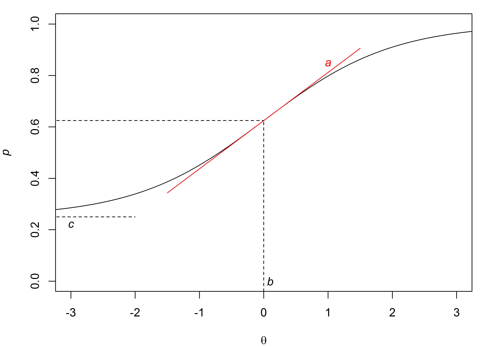
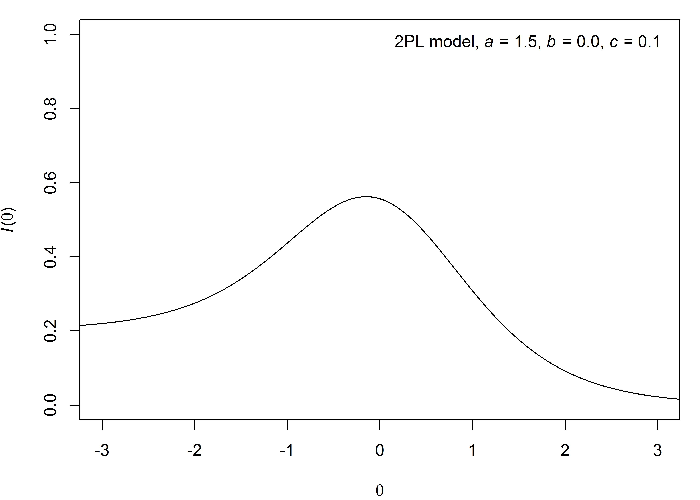
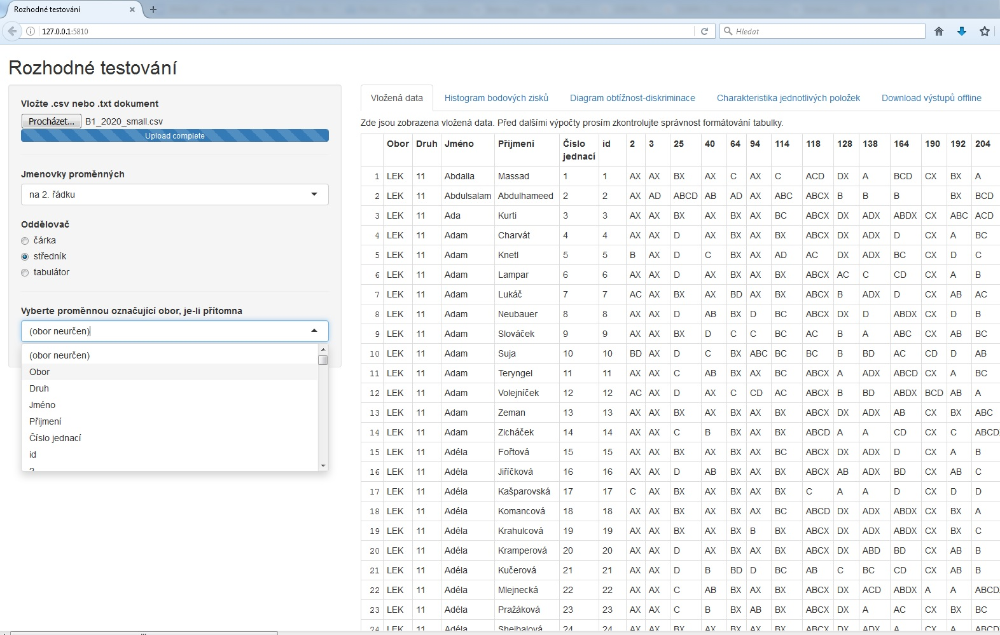
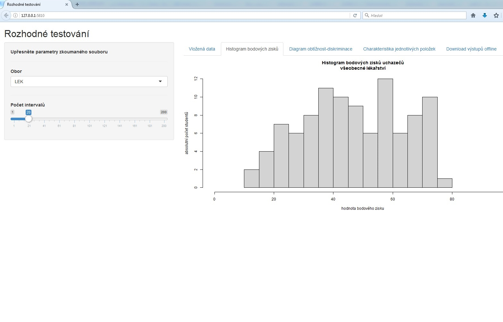
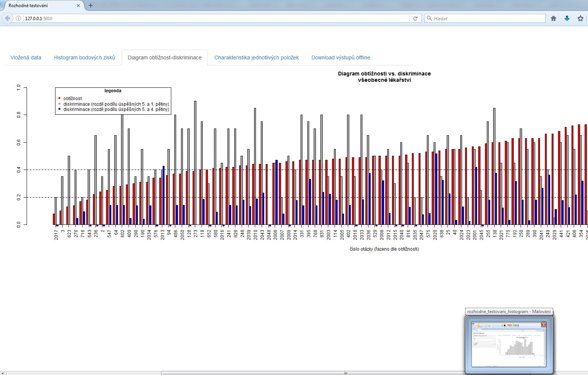
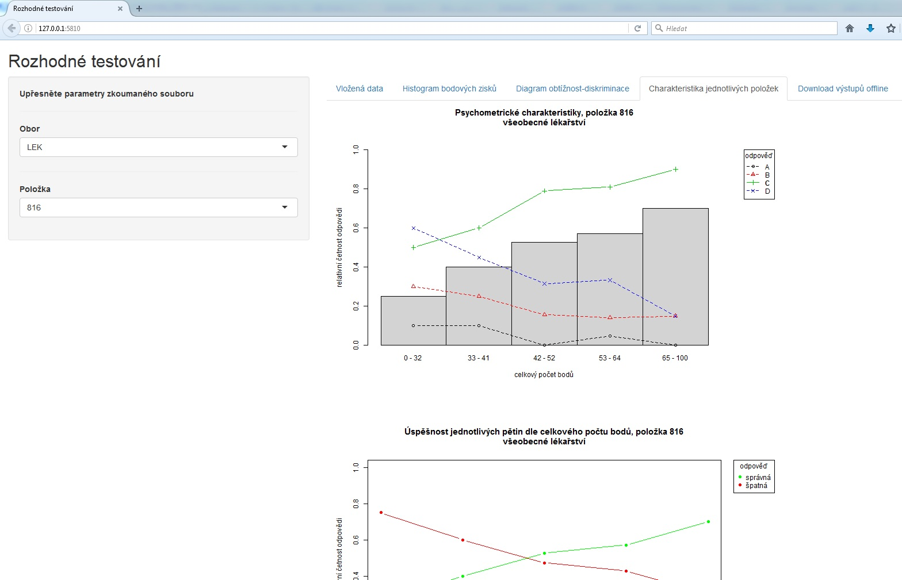

```{r setup, include = FALSE}
knitr::opts_chunk$set(echo = FALSE)
```


## Tříparametrový logistický model

- vrací pro respondenta s parametrem schopnosti $\theta$ pravděpodobnost $p_{i}(\theta)$, že správně odpoví na danou položku $i$

  \begin{equation*}
    p_{i}(\theta) = c_{i} + \frac{1 - c_{i}}{1 + e^{-a_{i}(\theta - b_{i})}} ,
  \end{equation*}
  
  kde $a_{i}$ je diskriminační schopnost položky $i$, $b_{i}$ je obtížnost položky $i$, $c_{i}$ je šance náhodného uhodnutí správné odpovědi na položku $i$
  
- oproti dvouparametrovému modelu zde navíc $c_{i}$, který je vhodný zavést pro položky typu multiple-choice (!)

- zřejmě je pro obecná $p_{i}$, $a_{i}$, $b_{i}$ a $c_{i}$

  \vspace{-1.5cm}
  \begin{align*}
    \phantom{p_{i}(\theta)} &\phantom{= c_{i} + \frac{1 - c_{i}}{1 + e^{-a_{i}(\theta - b_{i})}} ,} \quad \ \ \\
    p_{i}'(b_{i}) &= \frac{a_{i}(1 - c_{i})}{4}, \\
    p_{i}(b_{i}) &= \frac{1 + c_{i}}{2}, \\
    p_{i}(-\infty) &= c_{i}
  \end{align*}


## Tříparametrový logistický model

\center



## Tříparametrový logistický model v \textsf{R}

- knihovna `ltm`
- funkce `tpm()` s argumenty
    - `data` -- uklizený dataframe s daty položek ve sloupcích
    - `type` -- buďto `"rasch"`, předpokládáme-li shodnou diskriminaci všech položek ($\forall i : a_{i} = konst.$), anebo `"latent.trait"` jinak
    - `...`
- výsledky modelu pomocí `summary(tpm())`
- grafická interpretace pomocí `plot(tpm())`


## Tříparametrový logistický model v \textsf{R}

\scriptsize
```{r, eval = TRUE, echo = TRUE}

## inicializuji balíček "ltm" -----------------------------
suppressWarnings(library("ltm", quietly = TRUE))

## dívám se na data "LSAT" --------------------------------
head(LSAT, 5)

## modeluji triparametrovy model --------------------------
my_model <- tpm(data = LSAT, type = "latent.trait")

```


## Tříparametrový logistický model v \textsf{R}

\scriptsize
```{r, eval = TRUE, echo = TRUE}

## dívám se na svůj model ---------------------------------

my_model

```


## Tříparametrový logistický model v \textsf{R}

\scriptsize
```{r, eval = TRUE, echo = TRUE}

## dívám se na koeficienty modelu -------------------------

summary(my_model)$coefficients

```


## Tříparametrový logistický model v \textsf{R}

\scriptsize
```{r, eval = TRUE, echo = TRUE}

## zobrazuji model ----------------------------------------
plot(my_model)

```


## Tříparametrový logistický model v \textsf{R}

\scriptsize
```{r, eval = TRUE, echo = TRUE}

## zobrazuji jiný model -----------------------------------
plot(tpm(LSAT, type = "rasch", constraint = cbind(2, 1, 0)))

```


## Informace a informační křivka položky a testu

- informaci $I_{i}(\theta)$ položky ($I(\theta)$ testu) zde chápeme jako míru \textit{reliability}
- v jednoparametrovém logistickém modelu
  
  \vspace{-1.5cm}
  \begin{align*}
    \phantom{I_{i}(\theta)}&\phantom{=a_i^2 \frac{(p_i(\theta) - c_i)^2}{(1 - c_i)^2} \frac{1-p_i(\theta)}{p_i(\theta)}} \\
    I_{i}(\theta)&=p_{i}(\theta) (1-p_{i}(\theta))
  \end{align*}

- v dvouparametrovém logistickém modelu
  
  \vspace{-1.5cm}
  \begin{align*}
    \phantom{I_{i}(\theta)}&\phantom{=a_i^2 \frac{(p_i(\theta) - c_i)^2}{(1 - c_i)^2} \frac{1-p_i(\theta)}{p_i(\theta)}} \\
    I_{i}(\theta)&=a_{i}^2 p_{i}(\theta) (1-p_i(\theta))
  \end{align*}

- v tříparametrovém logistickém modelu

  \begin{equation*}
    I_{i}(\theta)=a_i^2 \frac{(p_i(\theta) - c_i)^2}{(1 - c_i)^2} \frac{1-p_i(\theta)}{p_i(\theta)}
  \end{equation*}


## Informace a informační křivka položky a testu

- informační křivka je zobrazení $f: \theta \rightarrow I_{i}(\theta)$, ideálně se přibližuje zvonovitému tvaru
- informační křivka testu je sumou informačních křivek položek, tedy
  
  \begin{equation*}
    I(\theta)=\sum\limits_{i} I_{i}(\theta)
  \end{equation*}

- informace testu souvisí s chybou testu tak, že

  \begin{equation*}
    \text{SE}(\theta) = \frac{1}{\sqrt{I(\theta)}} \quad \ 
  \end{equation*}


## Informace a informační křivka položky a testu

\center



## Informace a informační křivka položky a testu v \textsf{R}

\scriptsize
```{r, eval = TRUE, echo = TRUE}

## zobrazuji informační křivku položek --------------------
plot(tpm(LSAT), type = "IIC", ylim = c(0.0, 0.6))

```


## Informace a informační křivka položky a testu v \textsf{R}

\scriptsize
```{r, eval = TRUE, echo = TRUE}

## zobrazuji informační křivku celého testu ---------------
plot(tpm(LSAT), type = "IIC", items = 0, ylim = c(0.0, 0.6))

```


## 

\vspace{+3.0cm}
\begin{block}{}
  \centering
  Aplikace pro semi-real-time hodnocení přijímacího řízení na 1. LF UK
\end{block}


## Aplikace `rozhodne_testovani`

- určena uživateli, co nevidí do matematiky v modelech teorie odpovědi na položku
- produkuje infografiku souhrnně pro přijímací testy, rovněž zvlášť pro každou položku


## Aplikace `rozhodne_testovani`

- napsána prakticky celá v \textsf{R}, především pomocí knihovny `shiny`
- drobné úpravy pomocí CSS a javascriptu
- generuje automaticky cca 200-stránkové PDF s infografikou (`knitr`, `rmarkdown`, \TeX, `Pandoc`)
- běží dobře dekstopově, na \textsf{R}-kovém serveru 1. LF UK je online její alfa verze (linuxová architektura, \textit{encoding hell}, \TeX-life, `Pandoc`-life, zvláštní chování nebo nemožnost instalovat některé balíčky na serveru)
- soubory aplikace (celkem cca 4300 řádků převážně \textsf{R}-kového kódu)
    - `server.R`
    - `ui.R`
    - `rozhodne_testovani.myRscript`
    - `my_output.Rmd`
    - readme.pdf
    - složka www:
        - `busy.js`
        - `style.css`
        - `busy_indicator.gif`


## Aplikace `rozhodne_testovani`

\center



## Aplikace `rozhodne_testovani`

\center



## Aplikace `rozhodne_testovani`

\center



## Aplikace `rozhodne_testovani`

\center



## Hands-on! Your turn!

- dummy data, skripty a tato prezentace je na adrese

\centering
\href{https://github.com/LStepanek/Nekolik-postrehu-k-teorii-odpovedi-na-polozku/}{https://github.com/LStepanek/Nekolik-postrehu-k-teorii-odpovedi-na-polozku/}


## 

\vspace{+3.0cm}
\begin{block}{\centering Děkuji za pozornost!}
  \center
  \href{mailto:lubomir.stepanek@fbmi.cvut.cz}{lubomir.stepanek@fbmi.cvut.cz}
\end{block}

